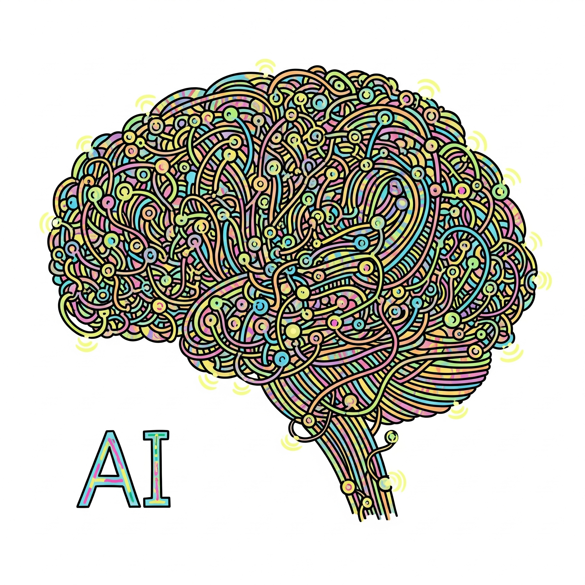

# 🤖🧠🌍 Demystifying Large Language Models (LLMs)!

Welcome to this beginner-friendly repository that **demystifies how Large Language Models (LLMs)** like **GPT**, **Gemini**, and others work – step by step! ✨

If you’ve ever wondered *"How can a machine generate text so well?"*, you're in the right place. This repo breaks down the key concepts behind LLMs in simple code and explanations. No AI degree needed! 👩‍💻👨‍🏫

  
   

---

## 📚 Repository Structure

Each folder in this repo is a **building block** that takes you closer to understanding how LLMs operate:

### 🧩 `01-byte-pair-encoding/`
**Concept:** Tokenization with **Byte Pair Encoding (BPE)**  
📖 [Read the README](./01-byte-pair-encoding/README.md)  
🛠️ Code: `bpe.py`  
Learn how words are split into subword units to make models efficient and flexible with language.

---

### 🔁 `02-bi-gram-models/`
**Concept:** Basic **Bi-gram Language Models**  
📖 [Read the README](./02-bi-gram-models/README.md)  
🛠️ Code: `bi_gram.py`  
📝 Sample Data: `data/sample_data.txt`  
Understand how simple statistical models predict the next word using word pairs.

---

### 🔥 `03-transformers/`
**Concept:** The magic of **Transformer models** (like GPT!)  
📖 [Read the README](./03-transformers/README.md)  
🛠️ Code: `gpt_demo.py`  
See how the Transformer architecture powers state-of-the-art language models.

---

## 🚀 Who Is This For?

This project is perfect for:
- 🧑‍🎓 Students curious about AI
- 🛠️ Developers wanting to peek under the hood
- 🧠 Enthusiasts who enjoy learning how things work

No advanced math or machine learning knowledge required. Just basic Python and curiosity! 🐍💡

---

## 💬 Why This Matters

Understanding LLMs helps us:
- Make informed decisions about AI usage
- Appreciate the complexity of tools like ChatGPT
- Build our own simple models from scratch!

---

## 📜 License

This project is licensed under the MIT License.